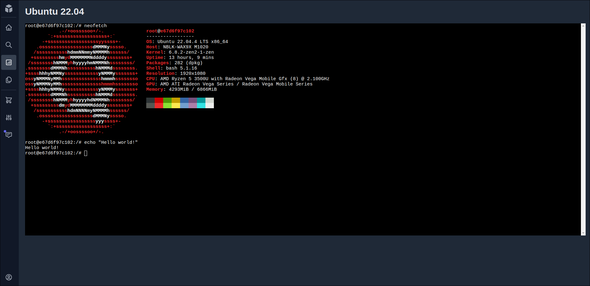

# WebConsole

This project allows you to interact with a Linux machine running on a remote Docker container directly from the browser. To run the project you'll need to run the Go http server on a Linux machine with a user on the `docker` group.

