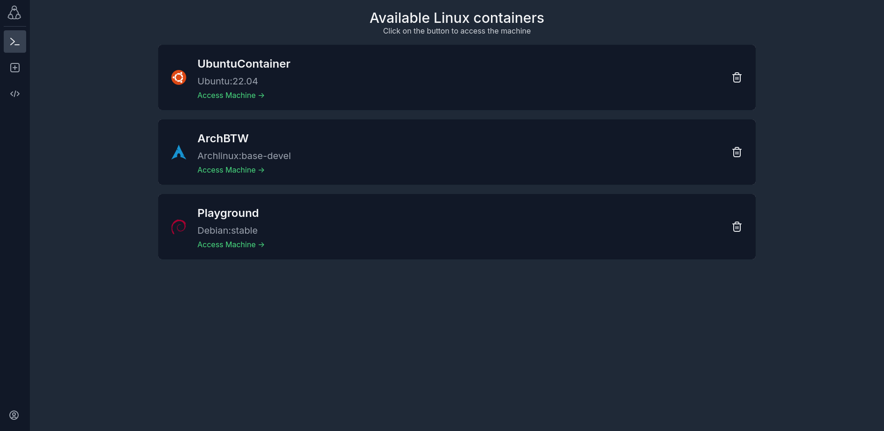
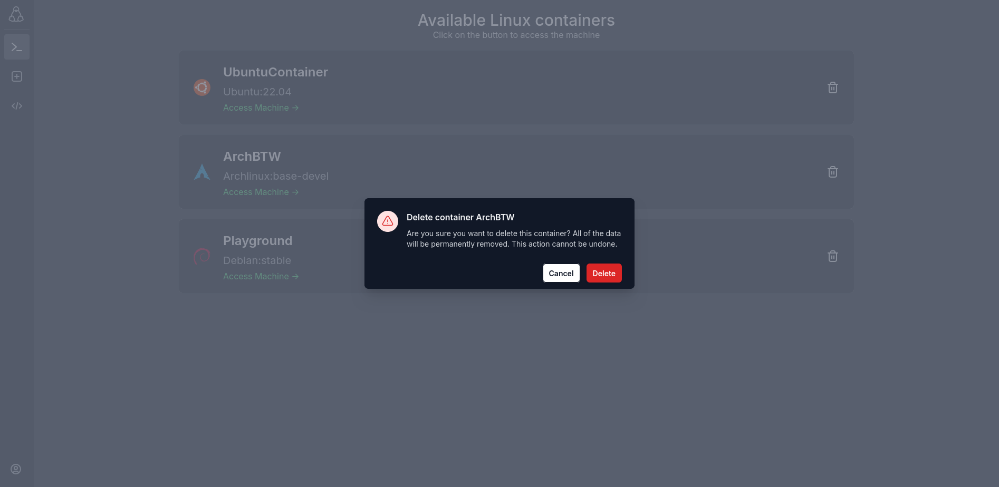
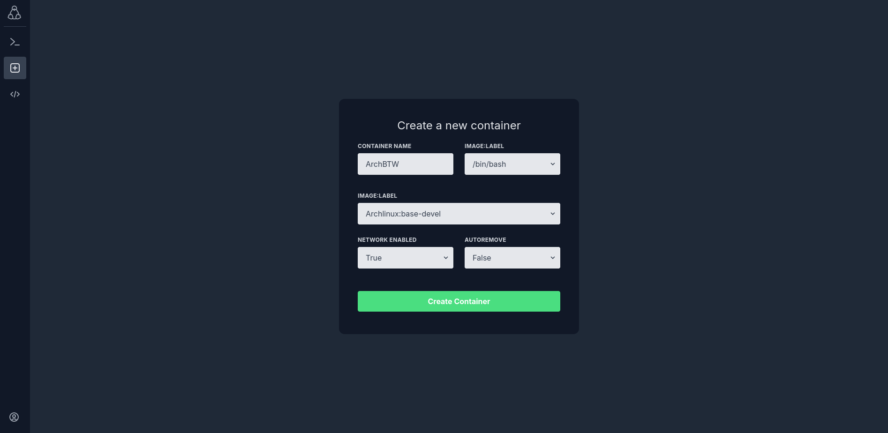
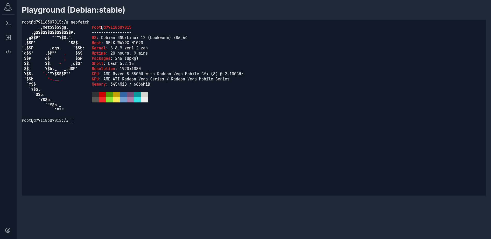
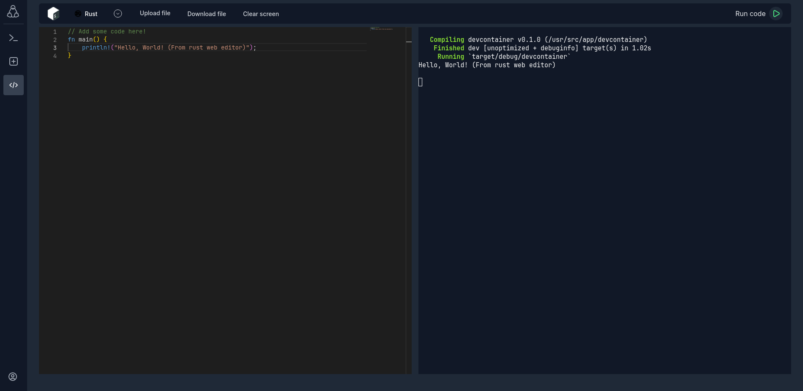
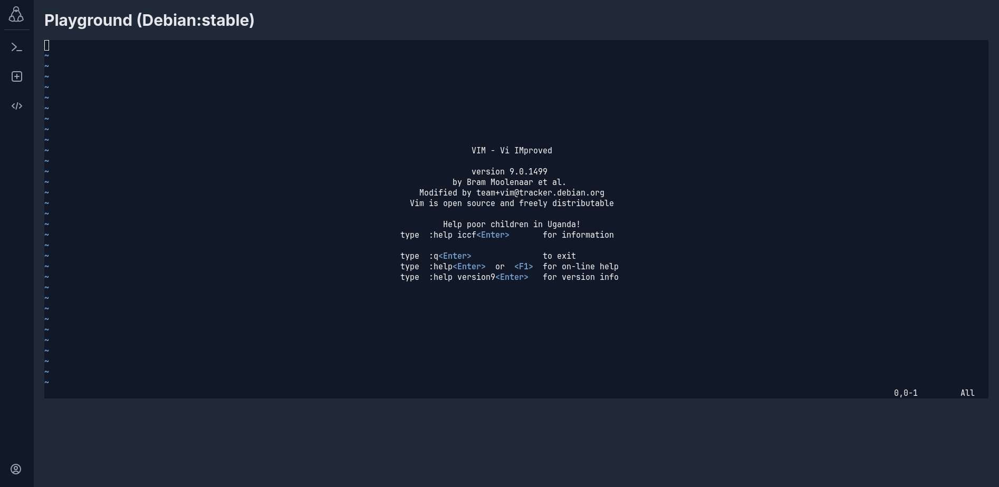
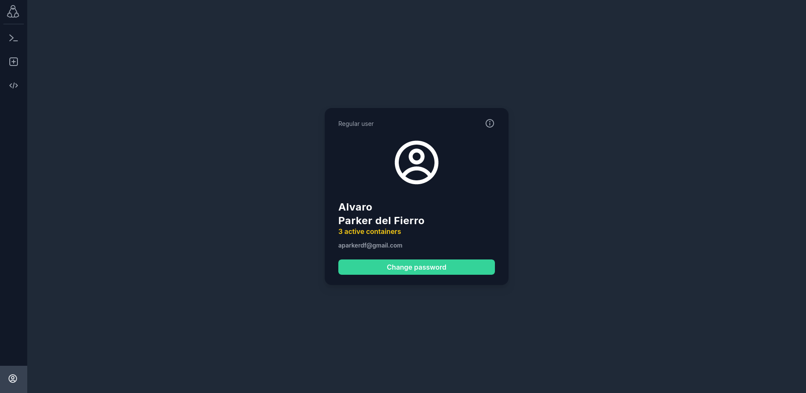

# WebConsole

This project allows you to interact with a Linux machine running on a remote Docker container directly from the browser. To run the project you'll need to run the Go http server on a Linux machine with a user on the `docker` group.















## How to build (for development)

Run the script to download and install the images used for code editing and the web terminal:
```
cd images/
./build.sh
```

Run docker compose to start the Database and the Frontend
```
docker compose up
```

Run the Golang backend on your machine, since it needs to connect to the Docker socket of you machine
```
go run cmd/api/main.go
```

If you want to make changes to the backend while also running it, you should execute it using `gowatch` instead:
```
gowatch -p cmd/api/main.go
```

## How to build (for production)
Todo!
